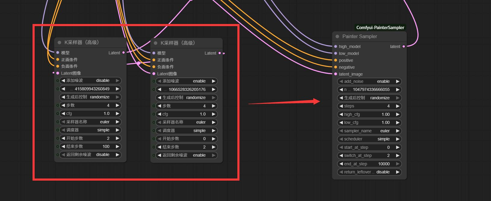

# PainterSampler for ComfyUI  
**ComfyUI 图生视频双模型串联采样器.本节点由抖音博主：绘画小子 制作**

---

**一个节点，一样画质。**  
One node, same quality.

**用单个 PainterSampler 替换两个 KSamplerAdvanced —— 显存、内存、生成效果完全一致。但是不需要再连那么多线，可以让你的工作流看起来更简洁 **  
Replace two KSamplerAdvanced with a single PainterSampler — same VRAM, same RAM, same frames.But there's no need to create so many node connections – this will make your ComfyUI workflow look much cleaner.
 
  
  ## 和comfyui官方采样器效果对比Comparison with the Ksampler of the official ComfyUI

<table>
  <tr>
    <td></td>
    <td></td>
    <td></td>
  </tr>
</table>
---

## 功能 | Features  
- **一步完成 Wan2.1 / Wan2.2 图生视频**  
  Wan2.1 / Wan2.2 image-to-video in ONE step  

- **高噪 + 低噪模型背靠背运行，无需额外采样器**  
  High-noise + low-noise models run back-to-back, no extra sampler needed  

- **像素级对齐官方工作流**  
  Pixel-perfect match to official workflow  

- **零开销，逐帧二进制相同**  
  Zero overhead, bit-identical frames  

---

## 安装 | Install  
1. 克隆到 custom_nodes 文件夹  
   Clone into custom_nodes:
```bash
cd ComfyUI/custom_nodes
git clone https://github.com/yourname/ComfyUI-PainterSampler.git
```
2. 重启 ComfyUI，节点出现在 sampling / painter  
   Restart ComfyUI, node appears in sampling / painter  

---

## 用法（4 步 Wan2.2 示例）| Usage (4-step Wan2.2)  

| 参数 | 中文 | English |
|---|---|---|
| high_model | 高噪模型（可接 LoRA）| high-noise model (LoRA if needed) |
| low_model | 低噪模型（可接 LoRA）| low-noise model (LoRA if needed) |
| steps | 4 | 4 |
| start_at_step | 0 | 0 |
| switch_at_step | 2 | 2 |
| end_at_step | 4 | 4 |
| return_leftover_noise | disable | disable |

**连接方式与 KSamplerAdvanced 完全一致，只需一个节点。**  
Wire exactly like KSamplerAdvanced — only one node.


---


## 许可证 | License  
MIT – 随意使用。  
MIT – use it however you want.
